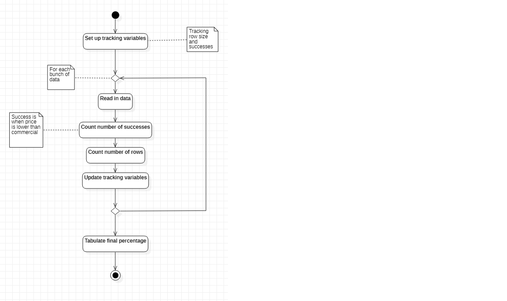

# Tally Example 
> This is a quick demononstration for using pandas to read in a large file and process in pieces. 

## Table of contents
* [General info](#general-info)
* [Code Structure](#code-structure)

## General info
Use this code with Juypter notebook, pandas, zipfile and numpy to get a sense for how to tabulate data. 

## Code Structure

